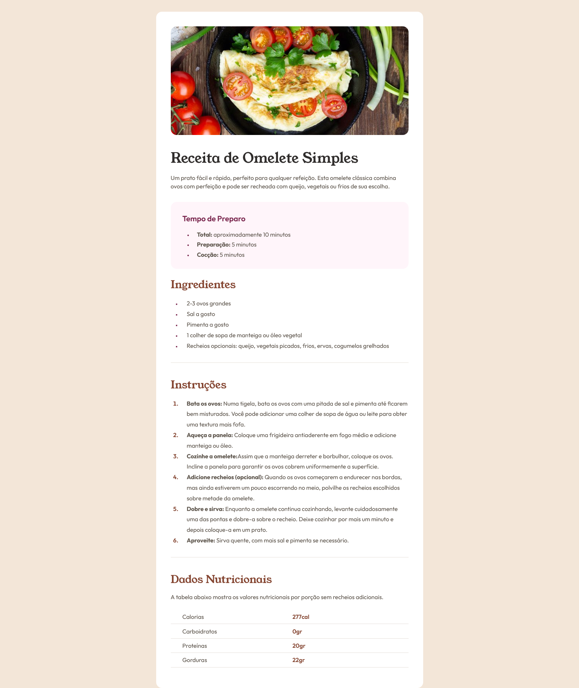

# CARTÃO DE RECEITA

## Conteúdo

- [CARTÃO DE RECEITA](#cartão-de-receita)
  - [Conteúdo](#conteúdo)
    - [Imagem](#imagem)
    - [Link GitPage](#link-gitpage)
    - [Construído Com](#construído-com)

### Imagem

### Link GitPage

- Solution URL: [Cartão de Receita](https://github.com/MarcelaCostaA/card-receita.git)

### Construído Com

- HTML5 semântico
- Flexbox
- CSS Flexbox

Esta é uma solução para [Recipe page challenge on Frontend Mentor](https://www.frontendmentor.io/challenges/recipe-page-KiTsR8QQKm)
